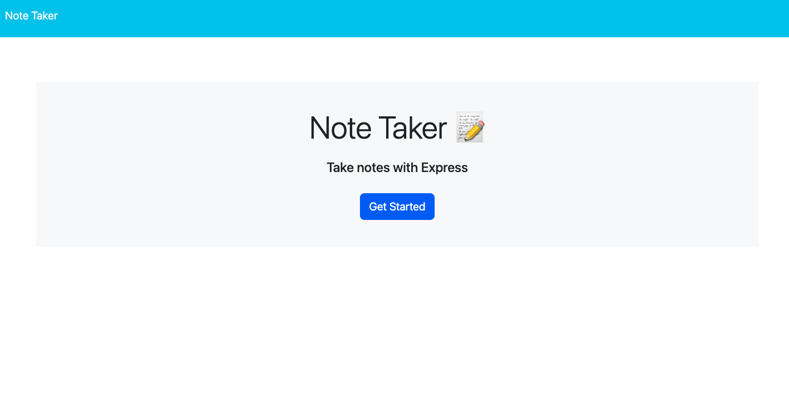

# NO-TES

## Description

This app will let you take notes and save them. you will also be able to edit and delete them as well.
## Installation

Install my-project with npm i

```bash
  npm i

```
    
## Usage/Examples

Click on the deployed application.

first you will need to click GET STARTED button.

next, type in a note title, and note text in the provided area.

then, you may click on the save icon and watch your note appear to the side of the screen.

after creating multiple notes, you can edit or delete as much as you need.


## Screenshots




## License

[MIT](https://choosealicense.com/licenses/mit/)

